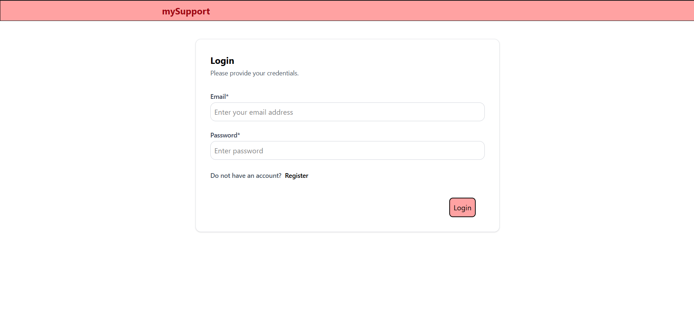
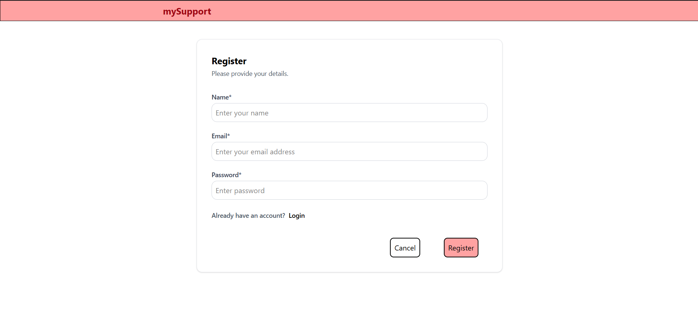
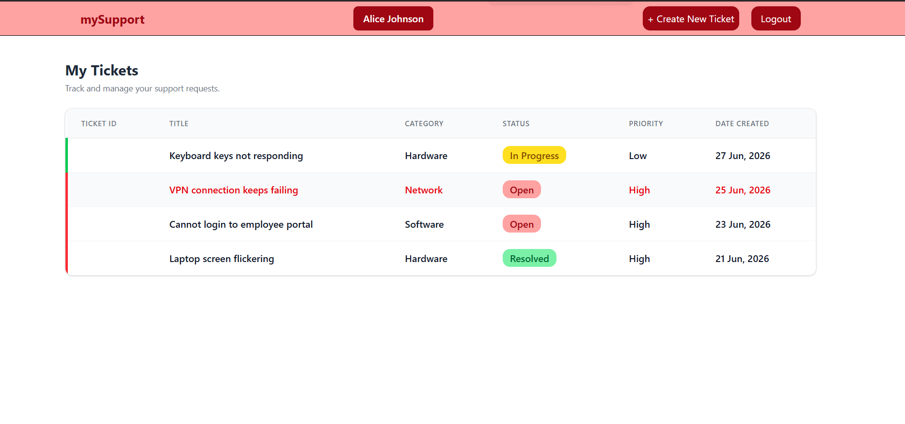
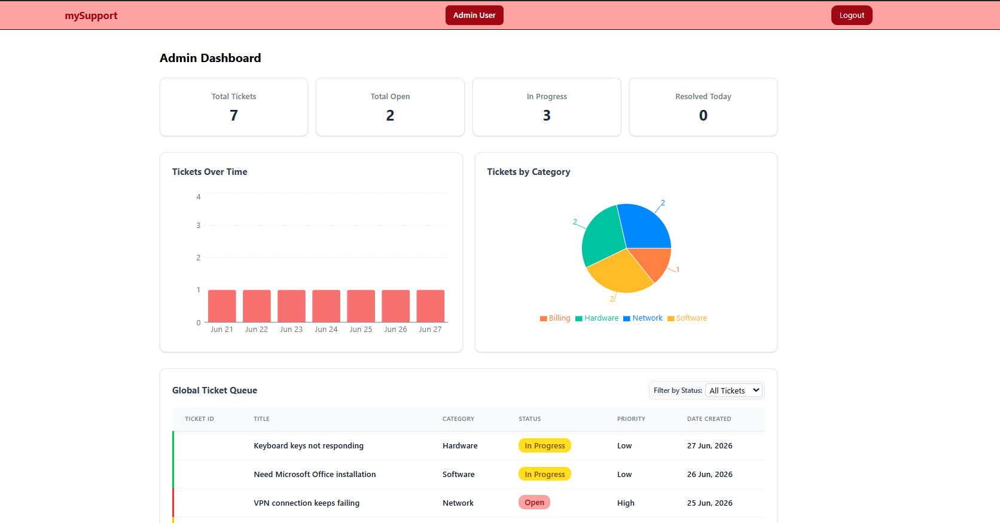
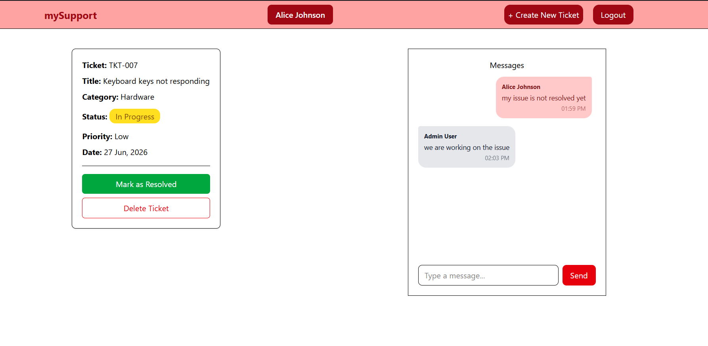

# 🎫 SupportFlow — Complaint Tracking System

> **COPS Summer of Code · Web Track · Week 2**

A full-stack customer support ticketing system built with React, Node.js, Express, and MongoDB. This project evolves the Week 1 `localStorage` prototype into a production-grade application with a REST API, JWT authentication, and a persistent database.

---

## 📸 Screenshots

<table>
  <tr>
    <td align="center"><b>Login</b></td>
    <td align="center"><b>Register</b></td>
  </tr>
  <tr>
    <td></td>
    <td></td>
  </tr>
  <tr>
    <td align="center"><b>Customer Dashboard</b></td>
    <td align="center"><b>Admin Dashboard</b></td>
  </tr>
  <tr>
    <td></td>
    <td></td>
  </tr>
  <tr>
    <td align="center" colspan="2"><b>Ticket Details & Live Chat</b></td>
  </tr>
  <tr>
    <td colspan="2" align="center"></td>
  </tr>
</table>

---

## ⚙️ Tech Stack

| Layer | Technology |
|---|---|
| Frontend | React + Vite |
| Backend | Node.js + Express.js |
| Database | MongoDB + Mongoose |
| Auth | JWT + bcrypt |

---

## ✨ Features

- **Secure Auth** — Registration and login with bcrypt-hashed passwords and JWT-protected API routes
- **Role-Based Access Control** — Separate customer and admin views with server-enforced permissions
- **Persistent Storage** — Full CRUD operations over a REST API, stored in MongoDB
- **Live Chat** — Ticket detail pages poll the server for new messages in real time
- **Admin Analytics** — KPIs and chart data computed server-side via MongoDB aggregation pipelines

---

## 🚀 Getting Started

### Prerequisites

- [Node.js](https://nodejs.org/) v16+
- [MongoDB](https://www.mongodb.com/) running locally or a MongoDB Atlas URI

---

### 1. Backend Setup

```bash
cd backend
npm install
```

Create a `.env` file inside `backend/`:

```env
PORT=8000
MONGO_URI=mongodb://localhost:27017/ticketing_system
JWT_SECRET=your_super_secret_jwt_key
CLIENT_ORIGIN=http://localhost:5173
```

Seed the database with sample users and tickets:

```bash
node seed.js
```

> ⚠️ This drops and re-creates the collections on every run.

Start the dev server:

```bash
npm run dev
# Running at http://localhost:8000
```

---

### 2. Frontend Setup

```bash
cd frontend
npm install
```

Create a `.env` file inside `frontend/`:

```env
VITE_API_BASE_URL=http://localhost:8000/api
```

Start the client:

```bash
npm run dev
# Running at http://localhost:5173
```

---

## 🔐 Default Accounts

After running `node seed.js`, the following accounts are available:

| Role | Email | Password |
|---|---|---|
| Admin | `admin@support.com` | `admin123` |
| Customer | `alice@example.com` | `password123` |

The admin account has access to the global ticket table, status management, and the analytics dashboard. New customer accounts can also be created via the `/register` page.